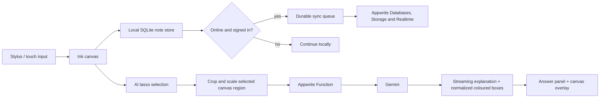
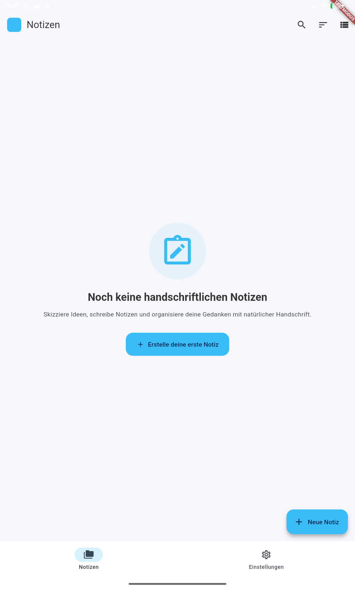
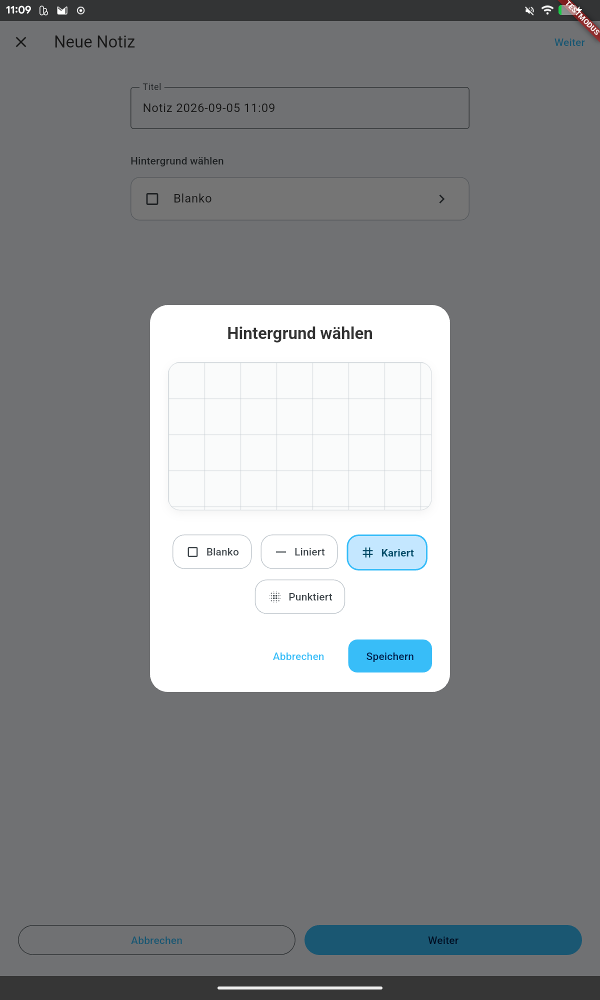
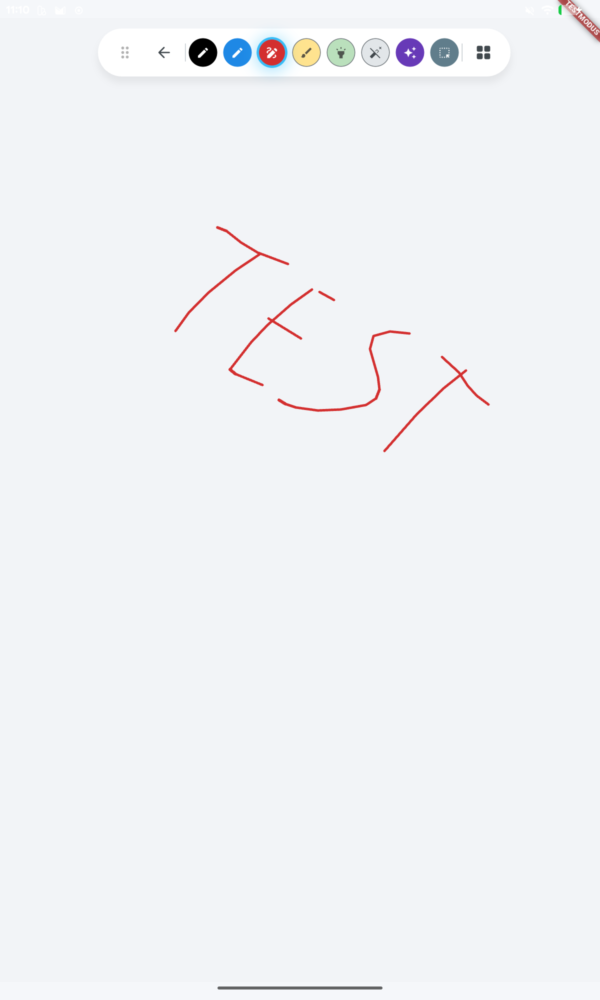
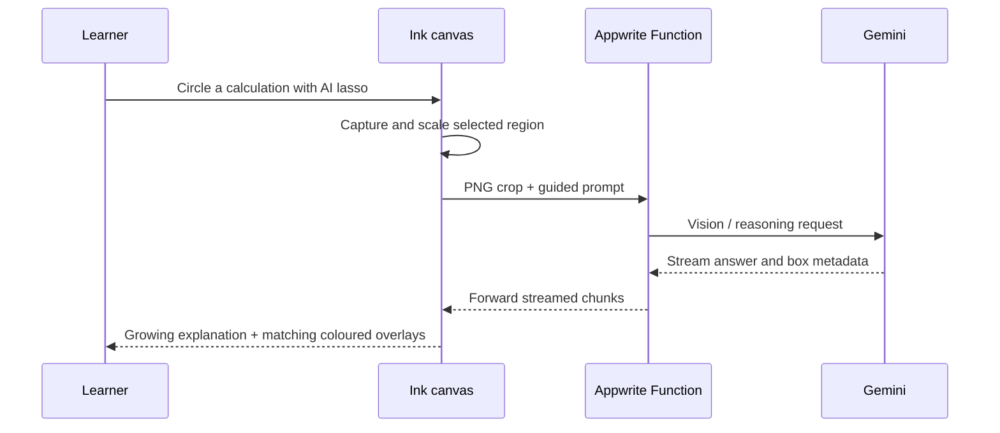
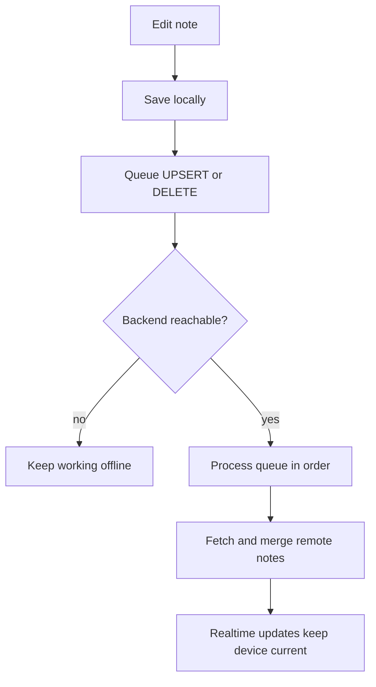
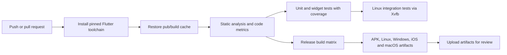

# Inkpadu — digital ink built for understanding, not just writing

Inkpadu is a cross-platform handwriting notebook for tablets and desktop. It combines a low-latency ink canvas, PDF annotation, local-first notes and an AI-assisted review workflow. The product idea is simple: learners should be able to circle a handwritten step, ask for help, and immediately see *where* the feedback applies — not receive an answer detached from the page.

This is a full Flutter project, not a UI prototype: it includes the mobile and desktop client, local persistence, synchronization, OAuth, an Appwrite backend and the AI workflow.

## At a glance



| Notes | Paper setup | Ink editor |
| --- | --- | --- |
|  |  |  |

The screenshots were captured from the Android tablet build. The red `TESTMODUS` ribbon identifies the backend-free build used for device testing and demos.

## Features

- Multi-page handwritten notes with blank, lined, squared or dotted paper.
- Ink, fineliner, fountain pen, brush and highlighter; erase, select, move, undo and redo strokes.
- PDF import, annotation directly on the page and PDF export.
- Local-first persistence: notes remain usable without login or connectivity.
- GitHub and Google sign-in via Appwrite; cross-device sync after login.
- A normal lasso for editing and an **AI lasso** for guided learning.

## AI lasso: feedback anchored to the handwritten page

Chat answers alone are not enough for handwritten calculations. The hard part is connecting an explanation to the exact term, line or operation that caused the mistake. Inkpadu's AI lasso makes this relationship visible.

1. A learner circles a region on the canvas.
2. The app renders only that region to a PNG and scales it down when needed.
3. The crop and an action such as **Tipp**, **Hilfe** or **Überprüfen** go to an Appwrite Function; no Gemini key is bundled into the client.
4. The AI response is streamed into the panel, so the explanation becomes readable as it arrives instead of waiting for a completed answer.
5. In parallel, the response contains optional coloured boxes in normalized `0…1000` coordinates.
6. Inkpadu maps each box back into the original lasso bounds and paints it on the zoomable canvas. The answer uses the same colours, making feedback directly traceable to the handwriting.



This coordinate contract is deliberate. The model sees a cropped raster image, but Inkpadu has to position feedback on a zoomable vector canvas. Normalized coordinates keep the AI response independent of device resolution and crop size.

The panel is movable and resizable, supports touch, stylus, mouse and keyboard scrolling, renders LaTex mathematics, and can insert generated HTML for visual results. The workflow is designed for learning rather than an unbounded chat: the built-in prompts make it possible to ask for a hint or a review without giving away the solution too early.

## Why the ink feels fluid

Handwriting makes every performance mistake visible. A page with hundreds of strokes cannot repaint and synchronize in the same way as a simple form. I separated input, rendering, persistence and network work deliberately.

| Challenge | Engineering decision |
| --- | --- |
| Dense, long stylus strokes | Ramer-Douglas-Peucker simplification moves to a separate isolate after 250 points, keeping the UI isolate responsive. Short strokes avoid isolate overhead. |
| Repainting an entire page | Finished ink is rendered into cached `Picture` tiles. Only tiles in the current viewport are rebuilt; off-screen tiles are purged to bound memory. |
| Recomputing geometry | Completed strokes cache their `Path`; structural edits invalidate the relevant cache instead of rebuilding every path continuously. |
| Erasing and selection | A bounding-box prefilter rejects most strokes before point-in-polygon or distance calculations run. |
| Saving while writing | Changes persist locally first; remote writes are debounced, preventing a burst of stylus events from becoming a burst of requests. |
| Large note payloads | Point data uses fixed-point coordinates, delta encoding, ZigZag + VarInt, gzip and Base64. Stroke metadata remains readable JSON and legacy formats are still decoded. |

The learning here was that smooth drawing is not a single optimization. It is a set of boundaries: only the stylus path stays on the critical rendering path; simplification, compression and synchronization move out of it.

## Why the code is structured this way

The folder structure is intentional. Inkpadu started as a drawing application, but grew into a system with interaction-heavy UI, durable local data, remote synchronization and AI. Keeping those concerns in one widget tree would make each change risky, so the project separates them at the points where change is most likely.

```text
lib/
├─ main.dart                         composition root: app lifecycle and shared scopes
├─ app/                              auth, routing, theme and app-wide configuration
├─ features/
│  ├─ drawing/                       reusable stroke, geometry and rendering foundation
│  │  ├─ domain/                     Stroke, DrawingPoint and NotePage data types
│  │  ├─ application/                simplification, shape recognition, controller logic
│  │  └─ presentation/               painters and platform-specific canvas/web views
│  ├─ ink/                           notebook-specific behavior built on drawing/
│  │  ├─ domain/                     InkNote, paper styles and drawing tools
│  │  ├─ application/                note controller, PDF export and shared scopes
│  │  ├─ infrastructure/             SQLite, Appwrite sync, codecs and connectivity
│  │  └─ presentation/               home/editor widgets, tool palette and AI lasso
│  ├─ home/, editor/, settings/      focused screens and their state
│  └─ onboarding/, input/            first-run and stylus/pointer concerns
├─ background/                       Workmanager entry point kept outside the UI lifecycle
└─ i18n/                             source translations and generated locale bindings
```

- **`main.dart` is a composition root, not a feature screen.** It wires
  authentication, notes, editor settings and pointer settings into scoped
  controllers once, then the UI can access them without passing long parameter
  chains through every widget.
- **`drawing/` is independent of `ink/`.** A stroke, a point, simplification
  and painting are useful primitives. The notebook layer adds pages, paper,
  sync and study behavior on top. This keeps performance-sensitive drawing
  code small and testable.
- **The application layer owns behavior; infrastructure owns I/O.** For
  example, `InkNotesRepository` coordinates local-first saves and a sync
  interface, while SQLite and Appwrite live behind that boundary. This is why
  the backend-free test mode can use the same note UI without mocking every
  screen.
- **Presentation code renders state instead of owning persistence.** Widgets
  delegate edits to controllers; controllers maintain undo/redo, cache
  invalidation and debounced writes. That reduces accidental rebuild work and
  makes widget tests meaningful.
- **The AI backend is deliberately separate.** The Flutter client handles
  selection, crop and coordinate transformation; the Appwrite Function holds
  the Gemini credential and model contract. A key rotation or model change
  therefore does not require a mobile-app update.

The same boundaries show up in `test/`: drawing algorithms, controller rules,
widgets and integration flows can be verified independently instead of relying
on one slow end-to-end test.

## Local-first synchronization

The notebook remains useful before a user has logged in and when a connection is unavailable. SQLite stores notes, their synchronization status and an ordered operation queue. Every edit lands locally first. When the device is online, the repository uploads pending changes, processes queued deletes, merges remote notes by timestamp and subscribes to Appwrite Realtime updates. Android additionally uses Workmanager to retry pending work in the background.



That design is about more than caching: deleted notes must not reappear after a later merge, retries need durable state, and a network error must never block a pen stroke.

## Backend and security boundaries

```text
Flutter client
  ├─ Appwrite OAuth (GitHub / Google) → session and user identity
  ├─ SQLite → notes and durable sync queue
  ├─ Appwrite Databases / Storage → note metadata, pages and PDF assets
  ├─ Appwrite Realtime → remote updates
  └─ Appwrite Function → selected image + guided prompt
                                └─ Gemini → streamed text + coloured boxes
```

The Appwrite endpoint and project ID are build-time configuration. OAuth secrets and the Gemini key stay with their providers or in the function environment, never in the mobile bundle. Release builds suppress debug logging to avoid leaking OAuth tokens or personal note content into device logs.

## Backend-free test mode

For tablet demos, UI testing and screenshots, Inkpadu now has an explicit backend-free build:

```bash
flutter build apk --debug --dart-define=INKPADU_TEST_MODE=true
```

It creates a local demo session, skips OAuth, Appwrite and background sync, and uses only local notes. The `TESTMODUS` ribbon ensures this cannot be mistaken for a production configuration. A normal build leaves the backend integration unchanged.

## Run and validate

```bash
flutter pub get
flutter run
flutter test
flutter test integration_test/app_test.dart
```

For a configured backend, set `APPWRITE_ENDPOINT` and `APPWRITE_PROJECT_ID` through `--dart-define` (or use the configured defaults in `lib/app/auth/appwrite_config.dart`).

For the complete Appwrite, OAuth, Gemini Function, Android callback and release-signing procedure, see the [setup guide](docs/SETUP.md).

## CI/CD: what I learned shipping a cross-platform app

Inkpadu taught me that CI/CD is not a deploy button; it is the discipline of
making every change reproducible and verifiable before it reaches a user. The
repository's GitHub Actions workflow runs on every pull request and every push
to `main`.



The pipeline in [`.github/workflows/quality.yml`](.github/workflows/quality.yml)
does the following:

1. Restores Flutter dependencies from a cache keyed by `pubspec.lock`, so CI
   is faster without silently changing dependency versions.
2. Runs static analysis, project metrics and unit/widget tests before a
   platform build is allowed to proceed.
3. Runs Linux integration tests in a virtual display, which catches flows that
   a unit test cannot cover.
4. Uses a build matrix for Android APK, Linux, Windows, iOS and macOS, then
   publishes the resulting binaries as GitHub Actions artifacts.

This is continuous integration plus release-ready artifact delivery. It does
**not** automatically publish to an app store — that boundary is intentional
because store credentials, signing and a human release decision should remain
outside the repository. Building this pipeline taught me to treat lockfiles,
cache keys, platform-specific dependencies, headless integration testing and
signed artifacts as parts of the product rather than afterthoughts.

## What I learned building Inkpadu

- AI becomes useful for learning when it is grounded in a deliberate user selection and can point back to that selection.
- A responsive drawing app needs explicit rendering, memory and geometry strategy; a `CustomPainter` alone is not enough.
- Offline-first behavior is a product feature: queue semantics, merge rules and deletion handling matter most when the network fails.
- A visibly labelled local build dramatically shortens the device-feedback loop and makes demos reproducible without depending on production services.
